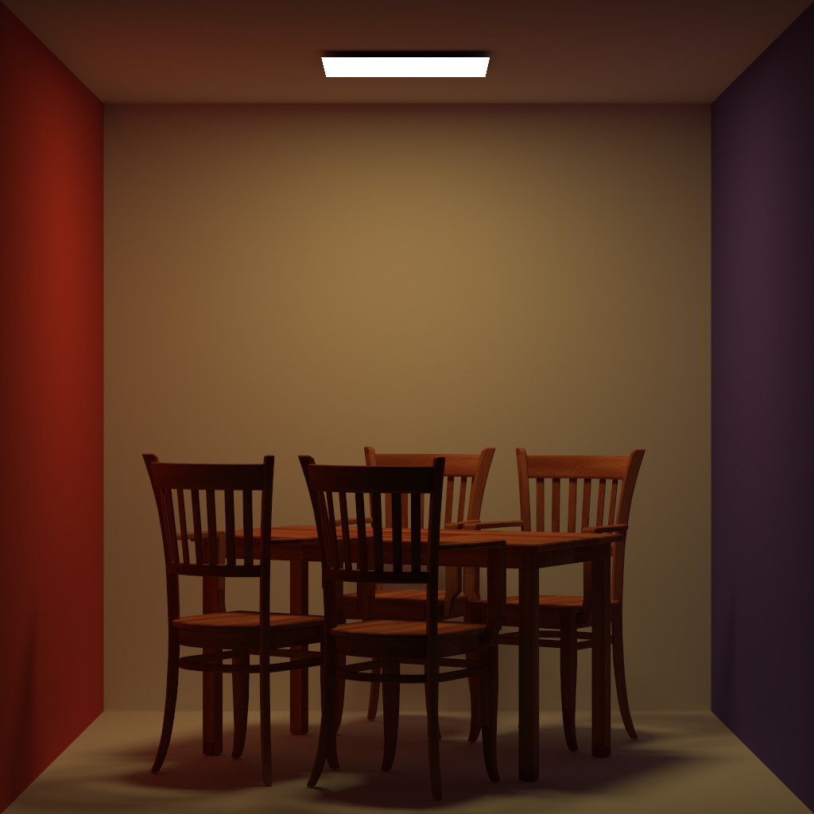
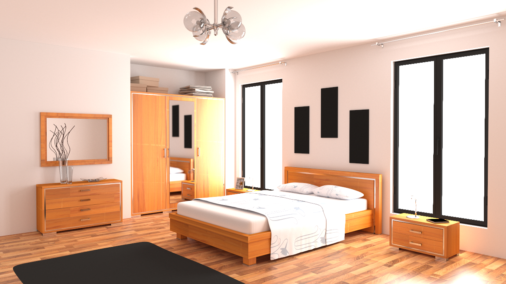

# Monte Carlo Path Tracer

## 编译运行

编译。项目仅依赖 `glm`

```
mkdir build && cd build
cmake .. && make
```

运行

```
./mcpt {directory} {name} {sample-number}
```

程序将会在 `{directory}` 下寻找以下文件

- `{name}.obj`
- `{name}.mtl`
- `{name}.xml`：包含相机和光源信息
- 其他图像文件，如果 mtl 文件中指定了纹理

以渲染的 cornell-box 为例

```
$ tree cornell-box
cornell-box
├── cherry-wood-texture.jpg
├── cornell-box.mtl
├── cornell-box.obj
└── cornell-box.xml
$ cat cornell-box/cornell-box.xml 
<?xml version="1.0" encoding="utf-8"?>
<camera type="perspective">
        <eye value="0, 1, 6.8"/> 
        <lookat value="0, 1, 5.8"/> 
        <up value="0, 1, 0"/>
        <fovy value="19.5"/>
        <width value="1024"/>
        <height value="1024"/>
</camera>
<light mtlname="Light" radiance="17, 12, 4"/>

$ ./mcpt ./cornell-box/ cornell-box 200
```

## 实现

该程序实现了一个 Monte Carlo Path Tracer。

该程序目前可以渲染下列材料：
- 漫反射材料以及镜面反射材料
- 带有纹理材料
- 透明玻璃

该程序使用了多重重要性采样（MIS），来结合 采样光源 与 采样 bsdf 的结果，使得 veach-mis 图像能够被正确渲染。

该程序使用了以下代码：

- [三角面片与光线求交](https://en.wikipedia.org/wiki/M%C3%B6ller%E2%80%93Trumbore_intersection_algorithm)
- [AABB 与光线求交](https://raytracing.github.io/books/RayTracingTheNextWeek.html#boundingvolumehierarchies/anoptimizedaabbhitmethod)
- [透明玻璃材料](https://raytracing.github.io/books/RayTracingInOneWeekend.html#dielectrics)

程序使用了以下依赖：

- [glm](https://github.com/g-truc/glm)
- [stb_image](https://github.com/nothings/stb)
- [tinyxml2](https://github.com/leethomason/tinyxml2)
- [tinyobjloader](https://github.com/tinyobjloader/tinyobjloader)


## 结果

cornell-box 采样 4 32 256 4096 次


bedroom 采样 4 32 256 4096 次


veach-mis 采样 4 32 256 4096 次


收敛结果





